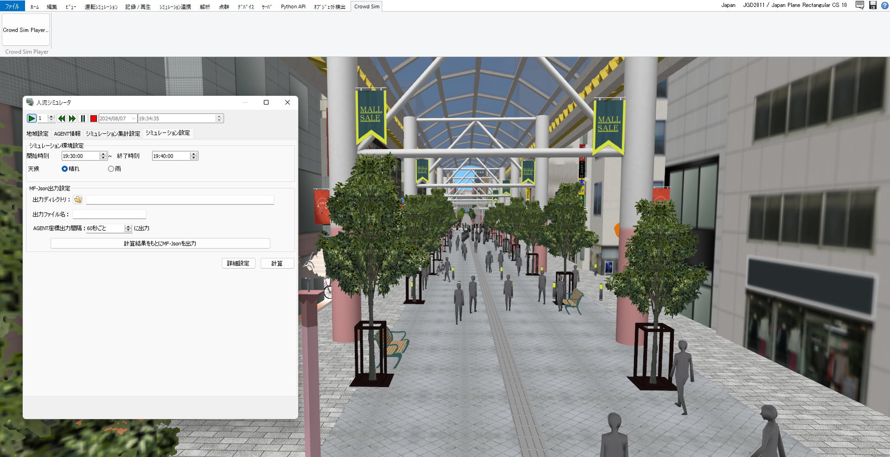

# 人流シミュレーションプラグイン（UC-win/Roadプラグイン） <!-- OSSの対象物の名称を記載ください。分かりやすさを重視し、できるだけ日本語で命名ください。英語名称の場合は日本語説明を（）書きで併記ください。 -->

 <!-- OSSの対象物のスクリーンショット（画面表示がない場合にはイメージ画像）を貼り付けください -->

## 更新履歴
| 更新日時 | リリース | 更新内容 |
| ---- | ---- | ---- |
| 2025/2/24 | 1st Release | 初版リリース |

## 1. 概要 <!-- 本リポジトリでOSS化しているソフトウェア・ライブラリについて1文で説明を記載ください -->
本リポジトリでは、Project PLATEAUの令和6年度のユースケース開発業務の一部であるUC24-07「汎用的な人流シミュレーションシステム」について、その成果物である「人流シミュレーションプラグイン（UC-win/Roadプラグイン）」のソースコードを公開しています。

「人流シミュレーションプラグイン（UC-win/Roadプラグイン）」は、PLATEAUの3次元都市モデルを活用し、汎用フォーマット人流データ「MF-JSON」を用いた人流シミュレーション及びシミュレーション結果の出力を行うためのシステムです。

## 2. 「汎用的な人流シミュレーションシステム」について <!-- 「」内にユースケース名称を記載ください。本文は以下のサンプルを参考に記載ください。URLはアクセンチュアにて設定しますので、サンプルそのままでOKです。 -->
「汎用的な人流シミュレーションシステム」では、都市開発、観光関連施策、イベント開催等における歩行空間設計や群衆制御といった分野での、データに基づく企画立案・合意形成・効果検証等を支援することを目的として本システムを開発しました。
本システムは、歩行者の目的地や歩行速度等の初期条件、障害物や天候等の制約条件を設定することで様々な状況下でのシミュレーションを実行できる人流シミュレーション機能に加えて、断面交通流の解析及びログ出力機能、シミュレーション計算結果やヒートマップ等の出力機能を実装しています。
本システムは、行政職員向けのGUIを備えたオープンソースソフトウェアとして開発されています。
本システムの詳細については[技術検証レポート](https://www.mlit.go.jp/plateau/file/libraries/doc/plateau_tech_doc_0030_ver01.pdf)を参照してください。

## 3. 利用手順 <!-- 下記の通り、GitHub Pagesへリンクを記載ください。URLはアクセンチュアにて設定しますので、サンプルそのままでOKです。 -->
本システムの構築手順及び利用手順については[利用チュートリアル](https://r5-plateau-acn.github.io/SolarPotential/)を参照してください。

## 4. システム概要 <!-- OSS化対象のシステムが有する機能を記載ください。 -->
### ①人流データ読み込み機能
- 汎用フォーマット人流データを読み込みます。

### ②CityGML読み込み機能
- CityGMLを読み込みます。
- [3D都市モデル標準製品仕様書 第4.1版](https://www.mlit.go.jp/plateaudocument/#toc0_02)に準拠するCityGMLを読み込んだ場合は、その属性情報に基づいて③による歩行エリア生成時に歩行可能エリアと歩行不可エリアが自動的に分類されます。

### ③歩行エリア生成・編集機能
- シミュレーションを実施する歩行エリアを生成します。
- 生成された歩行エリアについて、歩行可能・歩行不可等の状態を地点ごとに編集できます。

### ④歩行者の行動設定機能
- 人流データから取得した歩行者の行動について、歩行速度や衝突半径等の条件を設定できます。

### ⑤断面交通流計測機能
- 生成した歩行エリアの範囲内において、断面交通流の計測範囲を設定できます。
- ⑤によって設定された計測間隔ごとに計測範囲を通過した人数を記録・出力します。

### ⑥シミュレーション集計設定機能
- 断面交通流の計測間隔や地点ごとの人流の集計間隔等、シミュレーションの集計条件を設定できます。

### ⑦シミュレーション環境設定機能
- 日時や天候等、シミュレーション計算を行う環境を設定できます。

### ⑧シミュレーション計算機能
- 読み込んだ人流データと各種設定に基づいてシミュレーションを計算します。

### ⑨シミュレーション可視化機能
- 計算されたシミュレーションを3次元ベースで可視化します。

### ⑩シミュレーション結果解析・出力機能　
- シミュレーション結果を汎用フォーマット人流データで出力します。また、結果を解析し、画像やグラフで出力します。

## 5. 利用技術

| 種別        | 名称     | バージョン   | 内容                        |
| ----------- | --------|-------------|-----------------------------|
| ソフトウェア | [UC-win/Road](https://www.forum8.co.jp/product/ucwin/road/ucwin-road-1.htm) | 17.2.1 | 3次元リアルタイム・バーチャルリアリティソフト |
|             | [Delphi](https://www.embarcadero.com/jp/products/delphi) | 10.4.2 | 統合開発環境 |
| ライブラリ   | [UC-win/Road SDK](https://www.forum8.co.jp/product/ucwin/road/road-sdk.htm) | 17.0.0 | UC-win/Roadのカスタマイズ用API |
|             | [OpenGL](https://www.opengl.org/) | 4.6 | 3次元描画のためのグラフィックスAPI |
|             | [Menge](https://github.com/MengeCrowdSim/Menge) | 0.9.1 | 人流シミュレーション用の強力なクロスプラットフォームのモジュール式フレームワーク（シミュレーション計算に使用） |
|             | [MF-JSON](https://docs.ogc.org/is/19-045r3/19-045r3.html) | なし | 3次元形状の物体の移動データをJSONを用いて記述する簡潔な記述形式 |

## 6. 動作環境 <!-- 動作環境についての仕様を記載ください。 -->
| 項目               | 最小動作環境                            | 推奨動作環境                                  | 
| ------------------ | -------------------------------------- | ------------------------------------------- | 
| OS                 | Microsoft Windows 10 または 11（64bit） | 同左                                        | 
| CPU                | Intel Core i5以上                      | 同左                                         | 
| GPU                | NVIDIA製GPU                            | NVIDIA Geforce GTX1650以上（4GB以上のメモリ） | 
| メモリ          　  | 4GB以上                                | 32GB以上                                    | 
| ストレージ          | 最低30GB以上の空き容量                  | SSDドライブ 最低60GB以上の空き容量          | 
| ディスプレイ解像度   | 1920×1080以上                          | 同左          　　　　　　　　               | 
| ネットワーク        | 必須                                   | 同左                                        | 

## 7. 本リポジトリのフォルダ構成 <!-- 本GitHub上のソースファイルの構成を記載ください。 -->
### 【src】
| フォルダ名        |　詳細  |
|------------------|-------|
| F8CrowdSimPlugin | UC-win/Roadプラグインのソースコード |
| CrowdSim         | シミュレーション計算実行ソフトのソースコード |

### 【F8CrowdSimPlugin】
| フォルダ名Lv1         | フォルダ名Lv2    | フォルダ名Lv3      |　詳細  |
|----------------------|-----------------|-------------------|-------|
| Importer             |                 |                   | 各種データの読み込みに関する処理や読み込んだデータの管理 |
|                      | CityGML         |                   | CityGML読み込みに関する処理や処理後のデータの管理 |
|                      | MFJSON          |                   | MF-JSON読み込みに関する処理や処理後のデータの管理 |
|                      | TrafficSensor   |                   | 断面交通流データ読み込みに関する処理や処理後のデータの管理 |
| PeopleFlowAnalysis   |                 |                   | シミュレーション結果の解析や出力に関する処理及びデータの管理 |
|                      | Contour         |                   | コンターの生成や出力に関する処理 |
|                      | ExportsForm     |                   | データ出力用GUI |
|                      | FlowLog         |                   | シミュレーション結果の集計・解析処理や集計したデータの管理 |
|                      | HeatMap         |                   | ヒートマップの生成や出力に関する処理 |
| PeopleFlowSimulation |                 |                   | シミュレーションの実行に関する処理やデータの管理 |
| 　　　　　　　　　　　 | Menge           |                   | シミュレーション計算に関する処理やデータの管理 |
| 　　　　　　　　　　　 |                 | MengeUtils        | シミュレーション計算時の設定データやファイル出力の管理 |
| 　　　　　　　　　　　 |                 | XmlFormats        | シミュレーション計算時に出力されるxmlファイル用データの定義 |
|                      | PedestrianMap   |                   | 生成した歩行エリアの描画やデータの管理 |
|                      |                 | PedestrianMapUtil | 歩行エリアのマスごとの座標や状態等のデータの管理 |
| PlayerForm           |                 |                   | 人流シミュレーション設定用GUI |
|                      | imgs            |                   | GUIに使用されている画像データ |
|                      | PlayerFormFrame |                   | 機能ごとに分割されたGUIの一部 |
|                      |                 |                   | シミュレーション計算実行ソフトのソースコード |

### 【CrowdSim】
| フォルダ名 |　詳細  |
|-----------|-------|
| data      | シミュレーション計算時に受信するパケットデータの管理 |
| util      | 座標データの管理 |

## 8. ライセンス <!-- 変更せず、そのまま使うこと。 -->

- ソースコード及び関連ドキュメントの著作権は国土交通省に帰属します。
- 本ドキュメントは[Project PLATEAUのサイトポリシー](https://www.mlit.go.jp/plateau/site-policy/)（CCBY4.0及び政府標準利用規約2.0）に従い提供されています。

## 9. 注意事項 <!-- 変更せず、そのまま使うこと。 -->

- 本リポジトリは参考資料として提供しているものです。動作保証は行っていません。
- 本リポジトリについては予告なく変更又は削除をする可能性があります。
- 本リポジトリの利用により生じた損失及び損害等について、国土交通省はいかなる責任も負わないものとします。

## 10. 参考資料 <!-- 技術検証レポートのURLはアクセンチュアにて記載します。 -->
- 技術検証レポート: https://www.mlit.go.jp/plateau/file/libraries/doc/plateau_tech_doc_0030_ver01.pdf
- PLATEAU WebサイトのUse caseページ「汎用的な人流シミュレーションシステム」: https://www.mlit.go.jp/plateau/use-case/uc24-07/
