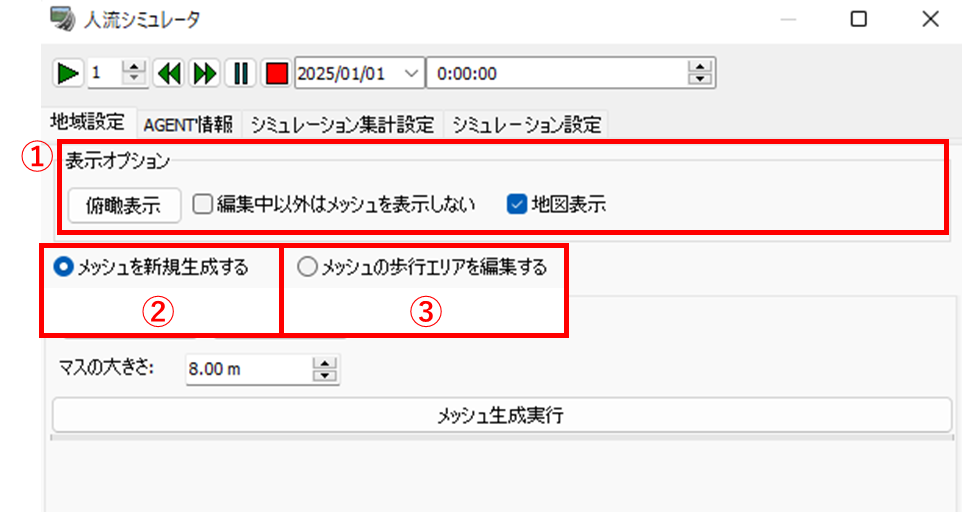
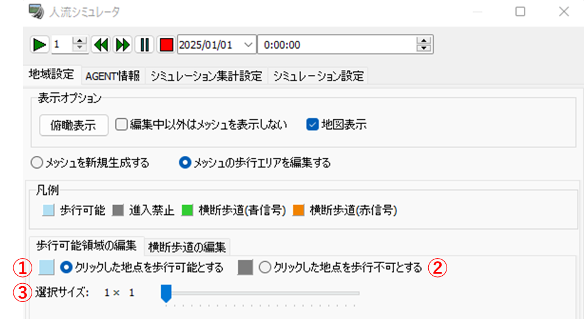
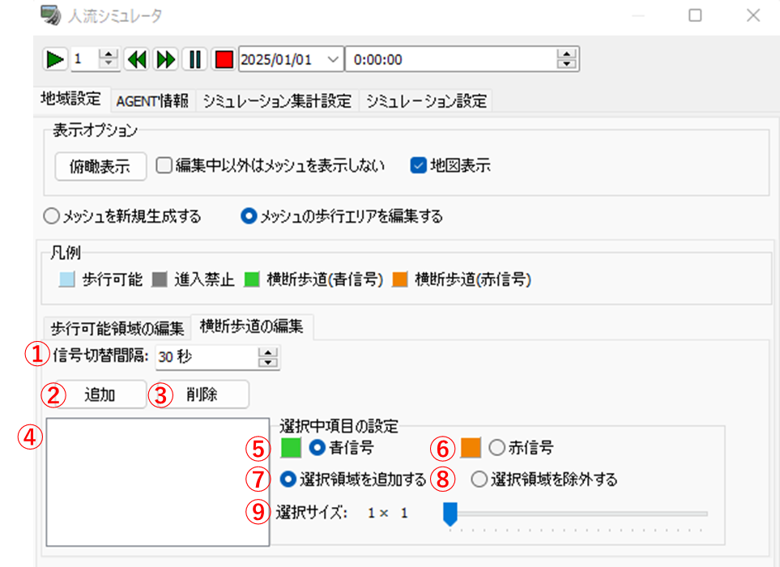

# 操作マニュアル

# 1 本書について

本書では、人流シミュレーションプラグイン（UC-win/Roadプラグイン）（以下「本システム」という。）の操作手順について記載しています。

# 2 使い方

## 2-1 プロジェクト読み込み画面

ファイル「UCwinRoad.exe」を実行すると以下の画面が表示されます。

① デフォルトのデータで新規プロジェクト（※）を作成し、読み込みます。

② クリックするとファイルダイアログが表示され、ダイアログ内で選択された既存のプロジェクトを読み込みます。

③ 地形データや地理院タイルをもとに新規プロジェクトを作成し、読み込みます。

④ 「UCwinRoad.exe」内のブラウザから任意のプロジェクトをダウンロードし、読み込みます。

（※）プロジェクトとは、拡張子が「.rd」のファイルのことをいいます。

## 2-2 MF-JSON読み込み画面

プロジェクトを読み込むと以下の画面（以下「UCwinRoadメイン画面」という。）が表示されます。

UCwinRoadメイン画面上部の「ファイル」タブ>>「インポート」>>「Import MF-Json...」をクリックすると以下の画面が表示されます。

① インポートするファイル

・追加したMF-JSONのファイル名が一覧で表示されます。ファイル名をクリックすると、そのMF-JSONを選択している状態になります。

② デフォルトモデル

・クリックすると、MF-JSONから取得した人物データ（以下「AGENT」という。）に割り当てる3Dキャラクターモデルを選択できます。

③ 詳細設定

・「+」ボタンをクリックすると画面が変化し、AGENTに性・年齢データが含まれていた場合や、シミュレーションの天候を雨に設定した場合に割り当てる3Dキャラクターモデルを選択できます。

・画面が変化している状態で「-」ボタンをクリックすると、元の表示に戻ります。

④ 追加

・クリックするとファイルダイアログが表示され、ダイアログ内で選択されたMF-JSONを追加します。

⑤ 削除

・クリックすると、①で選択中のMF-JSONを削除します。

⑥ インポート

・クリックすると、MF-JSONを読み込みます。読み込み完了後、自動的にMF-JSON読み込み画面を閉じます。

## 2-3 CityGML読み込み画面

UCwinRoadメイン画面上部の「ファイル」タブ>>「インポート」>>「CityGMLファイルのインポート」をクリックすると以下の画面が表示されます。

① インポートするファイル

・追加したCityGMLが一覧で表示されます。

② すべて選択

・クリックすると、追加したCityGMLをすべて選択します。

③ ファイルを追加

・クリックするとファイルダイアログが表示され、ダイアログ内で選択されたCityGMLを追加します。

④ オプション設定

・CityGML読み込み時の設定を行います。

⑤ インポート

・クリックすると、CityGMLを読み込みます。読み込み完了後、自動的にCityGML読み込み画面を閉じます。

⑥ 閉じる

・クリックすると、CityGMLを読み込まずにCityGML読み込み画面を閉じます。

⑦ ヘルプ

・クリックすると、CityGML読み込み画面に関するヘルプが表示されます。

## 2-4 人流シミュレーション設定画面

MF-JSON読み込み後にUCwinRoadメイン画面の「CrowdSim」タブ>>「Crowd Sim Player...」ボタンをクリックすると、以下の画面が表示されます。

① 「地域設定」タブ

・クリックすると、地域設定画面が表示されます。

② 「AGENT情報」タブ

・クリックすると、AGENT情報画面が表示されます。

③ 「シミュレーション集計設定」タブ

・クリックすると、シミュレーション集計設定画面が表示されます。

④ 「シミュレーション設定」タブ

・クリックすると、シミュレーション設定画面が表示されます。

## 2-4-1 地域設定画面

シミュレーションを実施する領域（以下「メッシュ」という。）の生成・編集を行う画面です。

① 表示オプション

・UCwinRoadメイン画面の表示に関する設定を行います。

② メッシュを新規生成する

・クリックすると、メッシュ新規生成画面が表示されます。

③ メッシュの歩行エリアを編集する

・クリックすると、歩行エリア編集画面が表示されます。

### 2-4-1-1 メッシュ新規生成画面

メッシュの生成を行う画面です。

① 原点を編集する

・クリックすると、メッシュの原点を選択するモードに移行します。この状態でUCwinRoadメイン画面の地形をクリックすると、クリックした地点をメッシュの原点として設定します。

② 範囲を編集する

・クリックすると、メッシュの範囲を選択するモードに移行します。この状態でUCwinRoadメイン画面の地形をクリックすると、クリックした地点をメッシュの終点として設定します。

③ マスの大きさ

・入力された値に基づいて、メッシュを正方形のマス単位に分割します。値を小さくするほど精緻なシミュレーションを行うことができますが、シミュレーション計算にかかる時間が増加します。

④ メッシュ生成実行

・クリックすると、メッシュを生成します。生成されたメッシュは読み込んだCityGMLの属性（※）に基づいて、マスごとに歩行可能エリアと歩行不可エリアを分類します。

・メッシュ生成完了後、自動的に歩行エリア編集画面が表示されます。

（※）[3D都市モデル標準製品仕様書 第4.1版](https://www.mlit.go.jp/plateaudocument/#toc0_02)に準拠するCityGMLが対象となります。CityGMLの属性がLOD1の道路（tran:Road）である場合はモデルが指定する全域が、LOD3の道路（tran:Road）である場合はモデルが指定する通行可能な領域（tran:TrafficArea）が歩行可能エリアとなります。

### 2-4-1-2 歩行エリア編集画面（歩行可能/不可）

メッシュの歩行エリアについて、歩行可能・歩行不可を編集する画面です。歩行エリア編集画面>>「歩行可能領域の編集」タブをクリックすると表示されます。

① クリックした地点を歩行可能とする

・選択されている状態でUCwinRoadメイン画面の地形をクリックすると、クリックした地点のマスを歩行可能エリアとして設定します。

② クリックした地点を歩行不可とする

・選択されている状態でUCwinRoadメイン画面の地形をクリックすると、クリックした地点のマスを歩行不可エリアとして設定します。

③ 選択サイズ

・クリックした地点を中心とし、表示されている値に基づいた範囲のマスをまとめて編集します。スライダーを動かすことで値を変更することができます。

### 2-4-1-3 歩行エリア編集画面（横断歩道）

メッシュの歩行エリアについて、横断歩道に関する編集を行う画面です。歩行エリア編集画面>>「横断歩道の編集」タブをクリックすると表示されます。

① 信号切替間隔

・入力されている秒数に基づいて、シミュレーション内で横断歩道の信号が切り替わります。

② 追加

・クリックすると、新しく横断歩道を追加します。

③ 削除

・クリックすると、④で選択中の横断歩道を削除します。

④ 横断歩道の一覧

・追加した横断歩道の名前が一覧で表示されます。横断歩道名をクリックすると、その横断歩道を選択している状態になります。

⑤ 青信号

・クリックすると、選択中の横断歩道を青信号から始まる（※）横断歩道として設定します。

⑥ 赤信号

・クリックすると、選択中の横断歩道を赤信号から始まる（※）横断歩道として設定します。

⑦ 選択領域を追加する

・選択されている状態でUCwinRoadメイン画面の地形をクリックすると、クリックした地点のマスを横断歩道として設定します。

⑧ 選択領域を除外する

・選択されている状態でUCwinRoadメイン画面の地形をクリックすると、クリックした地点のマスが横断歩道であった場合にそのマスを通常の歩行可能エリア・歩行不可エリアに戻します。

⑨ 選択サイズ

・クリックした地点を中心とし、表示されている値に基づいた範囲のマスをまとめて編集します。スライダーを動かすことで値を変更することができます。

（※）シミュレーション開始時刻における信号状態のことをいいます。

## 2-4-2 AGENT情報画面

AGENTに関する情報の表示と設定を行う画面です。

① AGENT情報のページ

・AGENT情報を一覧で表示している現在のページ番号と総ページ数が表示されます。

② AGENT情報

・AGENTのモデル、接続（シミュレーション計算の対象とするかどうか）、始点および終点の緯度・経度が表示されます。1ページあたり最大100人分の情報が表示されます。

③ 詳細設定

・クリックすると、シミュレーション計算に用いるAGENTのパラメータ（※）を設定する画面が表示されます。

（※）パラメータのうち「拡大係数」を有効にすると、入力された内容に応じてシミュレーション内での人流が本来の人流よりも多くなります。拡大係数を大きくするほどシミュレーション計算にかかる時間が増加します。

## 2-4-3 シミュレーション集計設定画面

人流シミュレーションのログデータ集計に関する設定を行う画面です。

① 通過データ集計間隔

・入力された値に応じて、メッシュのマスごとの通過人数を集計する間隔が変化します。

・マスごとの通過人数の集計結果は、ヒートマップ・コンターの生成に使用されます。

② ログ出力間隔

・入力された値に応じて、設定した断面交通流計測範囲の通過人数を集計する間隔が変化します。

・断面交通流計測範囲の通過人数の集計結果は、シミュレーション停止時にデータディレクトリ下の「Log」フォルダに出力されます。データディレクトリはUCwinRoadメイン画面上部の「ファイル」タブ>>「アプリケーション オプション」>>「デフォルト設定」から確認することができます。

③ 計測範囲左上を選択

・クリックすると、断面交通流計測範囲の左上（※）を選択するモードに移行します。この状態でUCwinRoadメイン画面の地形をクリックすると、クリックした地点を断面交通流計測範囲の左上座標として設定します。

④ 計測範囲左上を選択

・クリックすると、断面交通流計測範囲の右下（※）を選択するモードに移行します。この状態でUCwinRoadメイン画面の地形をクリックすると、クリックした地点を断面交通流計測範囲の右下座標として設定します。

⑤ 計測範囲名

・入力された内容を断面交通流計測範囲の名前として設定します。

⑥ 計測範囲を追加

・クリックすると、③～⑤で選択・入力された内容に基づいて断面交通流計測範囲を追加します。

⑦ 計測範囲確認

・クリックすると、追加した断面交通流計測範囲の名前が一覧で表示されます。そこから計測範囲名を選択すると、選択した計測範囲がUCwinRoadメイン画面上で強調表示されます。

⑧ 選択中の計測範囲を削除

・クリックすると、⑦で選択した計測範囲を削除します。

⑨ 計測範囲の一覧

・追加した計測範囲に関する情報が一覧で表示されます。

（※）断面交通流計測範囲の左上・右下は南からの視点が基準となります。

## 2-4-4 シミュレーション設定画面

人流シミュレーションの計算に関する設定を行う画面です。

① シミュレーション計算時刻

・入力された開始時刻から終了時刻までのシミュレーションを計算します。

② 天候

・選択された天候下でのシミュレーションを計算します。

③ 出力ディレクトリ、出力ファイル名

・入力されたフォルダのパスとファイル名に基づいて、シミュレーション計算結果のMF-JSONを出力します。

④ AGENT座標出力間隔

・MF-JSONを出力する際に、計算された各AGENTの座標を入力された秒数ごとに出力します。0秒とした場合は全て（0.1秒ごと）の座標を出力します。

⑤ 計算結果をもとにMF-JSONを出力

・シミュレーション計算完了後にクリックすると、計算結果を汎用フォーマット人流データのMF-JSONとして出力します。

⑥ 詳細設定

・クリックすると、シミュレーション計算の通信に関する設定を行う画面が表示されます。

⑦ 計算

・クリックすると、シミュレーション計算実行ソフト「CrowdSim.exe（※1）」を自動的に起動してシミュレーション計算（※2）を行います。

（※1）「CrowdSim.exe」が起動すると以下の画面が表示されます。

（※2）シミュレーション計算中は以下の画面が表示されます。「計算が終了しました。」というメッセージが表示されると計算完了となります。

## 2-4-5 シミュレーション再生画面

シミュレーション計算完了後、人流シミュレーション設定画面上部のボタンから計算したシミュレーションを再生することができます。

① 再生ボタン

・クリックすると、UCwinRoadメイン画面上でシミュレーションを再生します。

② 再生速度

・入力された値に応じて、巻き戻し・早送り時のシミュレーションの再生速度が変化します。

③ 巻き戻しボタン

・クリックすると、シミュレーションを巻き戻します。巻き戻し中に再度クリックすると、巻き戻しを終了します。

④ 早送りボタン

・クリックすると、シミュレーションを早送りします。早送り中に再度クリックすると、早送りを終了します。

⑤ 一時停止ボタン

・クリックすると、シミュレーションを一時停止します。一時停止中に再度クリックすると、一時停止を解除します。

⑥ 停止ボタン

・クリックすると、シミュレーションを停止します。シミュレーション再生中にクリックすると、停止後に出力データ選択画面が表示されます。

⑦ シミュレーション日時

・入力された日時からシミュレーションが開始されます。

 

## 2-4-6 出力データ選択画面

再生中のシミュレーションを停止すると、以下の画面が表示されます。

① 「断面交通流解析結果」タブ

・クリックすると、断面交通流解析結果画面が表示されます。

② 「ヒートマップ生成」タブ

・クリックすると、ヒートマップ生成画面が表示されます。

③ 「コンター生成」タブ

・クリックすると、コンター生成画面が表示されます。

 

### 2-4-6-1 断面交通流解析結果画面

シミュレーション再生中に各断面交通流計測範囲を通過した人数が折れ線グラフで表示されます。縦軸は人数、横軸はシミュレーション経過時間となります。

「解析結果を画像として保存する」をクリックするとファイルダイアログが表示され、解析結果のグラフを画像データとしてダイアログ内で選択されたフォルダに出力します。

 

### 2-4-6-2 ヒートマップ生成画面

① ヒートマップを生成するシミュレーション区間

・入力されたシミュレーション区間の人流がヒートマップとして生成されます。シミュレーション集計設定画面で入力された通過データ集計間隔が指定できる区間の最低分解能となります。

② ヒートマップを生成する

・クリックすると、ヒートマップ生成結果画面が表示されます。

 

ヒートマップ生成結果画面では、指定されたシミュレーション区間の人流のヒートマップが表示されます。

「画像として保存する」をクリックするとファイルダイアログが表示され、生成されたヒートマップと凡例を画像データとしてダイアログ内で選択されたフォルダに出力します。

 

### 2-4-6-3 コンター生成画面

① コンターを生成するシミュレーション区間

・入力されたシミュレーション区間の人流がコンターとして生成されます。シミュレーション集計設定画面で入力された通過データ集計間隔が指定できる区間の最低分解能となります。

② コンターを生成する

・クリックすると、コンター生成結果画面が表示されます。

 

コンター生成結果画面では、指定されたシミュレーション区間の人流のコンターが表示されます。

「画像として保存する」をクリックするとファイルダイアログが表示され、生成されたコンターと凡例を画像データとしてダイアログ内で選択されたフォルダに出力します。

 

# 3 出力データ

本システムで出力されるデータは以下のとおりです。

| 出力データ                         | 内容                                                                                                                         | データ形式     |
| --------------------------------- | ---------------------------------------------------------------------------------------------------------------------------- | ------------- |
| 断面交通流ログ               　    | 断面交通流計測範囲名、シミュレーション経過時間、シミュレーション時刻、計測範囲（緯度・経度）およびその座標、通過人数を記載したデータ。    | CSV           |
| シミュレーション計算結果の人流データ | シミュレーション計算結果を汎用フォーマット人流データに変換したデータ。                                　　　　　　　　　　　　　　　　　　  | JSON          |
| 断面交通流解析結果　　　　　　　　　 | 断面交通流計測範囲の通過人数を折れ線グラフで記録した画像データ。                                                            　　　 | PNG、JPEG、BMP |
| ヒートマップ        　　　　　　    | メッシュのマスごとの通過人数をヒートマップで記録した画像データ。       　　　　　　　                                               | PNG、JPEG、BMP |
| コンター         　　　　　　　 　  | メッシュのマスごとの通過人数をコンターで記録した画像データ。    　　　　　　　                                                      | PNG、JPEG、BMP |

## 3-1 断面交通流ログ

シミュレーション集計設定画面で追加した断面交通流計測範囲ごとに、計測範囲名、シミュレーション経過時間、シミュレーション時刻、計測範囲（緯度・経度）およびその座標、通過人数がCSV形式で出力されます。

 

## 3-2 シミュレーション計算結果の人流データ

シミュレーション設定画面より、人流シミュレーションの計算結果が汎用フォーマット人流データ（JSON形式）で出力されます。

出力されたJSONファイルは[人流可視化ツール](https://crowd-simulation.f8vps.jp/#/scene/expt)での利用が可能です。

 

## 3-3 断面交通流解析結果

断面交通流解析結果画面より、断面交通流解析結果のグラフが画像（PNG、JPEG、BMP形式）で出力されます。

 

## 3-4 ヒートマップ

ヒートマップ生成結果結果画面より、ヒートマップとその凡例が画像（PNG、JPEG、BMP形式）で出力されます。

 

## 3-5 コンター

コンター生成結果画面より、コンターとその凡例が画像（PNG、JPEG、BMP形式）で出力されます。

 
